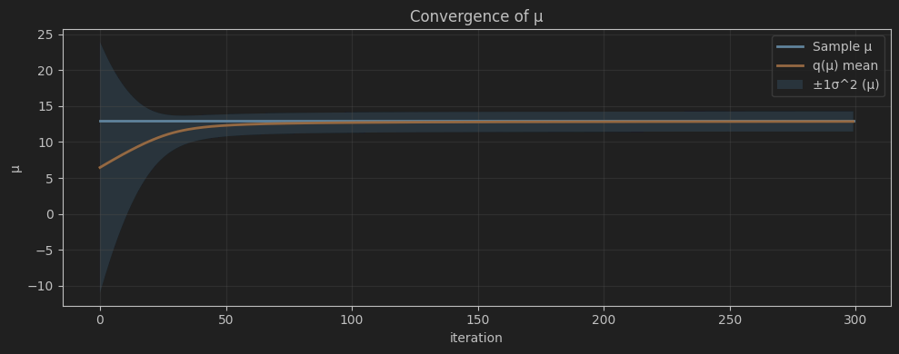

# Variational Message Passing

Below is an example of Variational Message Passing usage to approximate variance and mean value of an unknown distribution. In that particular example tested sample is generated by using normal distribution.

## Some Theory
*Original idea by John Winn and Christopher M. Bishop. 2005. Variational Message Passing. J. Mach. Learn. Res. 6 (12/1/2005), 661–694.*

So, Variational Message Passing use the same basic idea as Variational Approximation:

$$
Q(\mathbf{H})=\prod_{i} Q_{i}(\mathbf{H}_{i})
$$

This is idea that we can separate set of variables into smaller disjoint sets. Although in reality, this is almost impossible. But for goals of approximation, this idea helps us get rid of integrals for calculation of conditional variables. This is the only assumption we need to begin our process.

In every iteration, we approximate selected set and fix others set values. After approximation, the set is fixed and we move to the next set. Then process repeat.

$$
\ln Q_i^\*(\mathbf H_i)
= \big\langle \ln p(\mathbf H,\mathbf V) \big\rangle_{Q_{\neg i}} + \text{const}
$$

VMP turns this into local messages on a factor graph: each update only needs expectations from neighboring nodes (expected natural parameters), which makes the algorithm modular and fast.

## Model used in the code

Assuming data $(x_1,\dots,x_N)$ with $x_n \mid \mu, v \sim \mathcal N(\mu,\, \sigma^2),$
and independent priors $\mu \sim \mathcal N(m_0,\ \beta), \sigma^2 \sim \mathrm{InvGamma}(a,\ b). $

I approximate with the mean-field family

$$
Q(\mu)\,Q(v)
= \mathcal N(\mu;\ m,\ \beta) \times \mathrm{InvGamma}(\sigma^2; a, b).
$$

> **Notation.** For the variance node $v$ we use the **shape–scale** parameterization.
> Useful expectations:
> $\mathbb E\!\left[\tfrac{1}{v}\right]=\frac{a}{b},
> \qquad
> \mathbb E[\ln v]=\ln(b)-\psi(a).$

---

## Messages and updates (what the code implements)

### 1) Variance $v\to$ data $x_n$

Same for all $n$:

$$\langle \mathbf u_v \rangle=\begin{bmatrix}
\langle 1/v\rangle\\[2pt]
\langle \ln v\rangle
\end{bmatrix}=
\begin{bmatrix}
\alpha/\beta\\[2pt]
\ln\beta-\psi(\alpha)
\end{bmatrix}.$$

### 2) Data $x_n \to$ mean $\mu$
Using only $\langle 1/v\rangle$:
$$
m_{x\to v} =
\begin{bmatrix}
\langle 1/v\rangle\,x_i\\[2pt]
-\tfrac12\,\langle 1/v\rangle
\end{bmatrix}.
$$
Summing over \(n\) and adding the Normal prior on $\mu$ gives canonical parameters
$$
\phi_u =
\begin{bmatrix}
\beta\mu\\[2pt]
-\beta/2
\end{bmatrix} +
\sum_{n=1}^N m_{x\to \mu}
$$

$$
\mu=-2 * \phi_u[1]
\qquad
\beta=\phi_u[0] / -2 * \phi_u[1]
$$

### 3) Mean $\mu \to$ data $x_n$
The message needs the moments of $\mu$:
$$
\langle \mu\rangle = m,
\qquad
\langle \mu^2\rangle = m^2 + \beta^{-1}.
$$

### 4) Data $x_n \to$ variance $v$
Per datum (in the $[\ln v,\ 1/v]$ sufficient-stat order):
$$
m_{x\to y} =
\begin{bmatrix}
-\tfrac12\\[4pt]
-\tfrac12\,\mathbb E\!\big[(x_i-\mu)^2\big]
\end{bmatrix},
\qquad
\mathbb E\!\big[(x_i-\mu)^2\big]=(x_i-m)^2+\beta^{-1}.
$$
Summing over $n$ combining with the $\mathrm{InvGamma}(\alpha_0,\beta_0)$ prior yields the closed-form update
$$
\alpha = \alpha_0 + \frac{N}{2},
\qquad
\beta = \beta_0 + \frac{1}{2}\sum_{n=1}^{N}\big((x_n-m)^2+\beta^{-1}\big).
$$

### Results and Conclusion

I implemented Variational Message Passing (VMP) for a Gaussian likelihood with
an unknown mean and variance, using a Normal factor for the mean and an
Inverse-Gamma factor for the variance. Under the mean-field assumption
$Q(\mu)Q(v)$, each iteration requires only local expectations:

- the mean update uses $ \mathbb{E}[1/v] = \alpha/\beta $;
- the variance update uses the summed expected squared residuals
  $ \sum_n \mathbb{E}[(x_n-\mu)^2] = \sum_n (x_n-m)^2 + N/\beta $.

With sensible priors (weak Normal prior on $\mu$, shape–scale Inv-Gamma for $v$
centered near the data variance) the algorithm converges quickly and stably:
$m$ moves from the prior toward the sample mean, while the posterior over
$v$ tightens around the empirical variance. Using fixed priors $(\alpha_0,\beta_0)$
at every iteration (rather than accumulating $\alpha$) and maintaining
the correct message signs/order $[\ln v,\,1/v]$ prevents numerical issues
(NaNs, negative scales). Optional damping further stabilizes updates on
noisy datasets.

Overall, VMP reproduces the closed-form conjugate updates while exposing
them as modular “messages,” making the approach easy to extend to larger
graphs (e.g., hierarchical means, mixture models).

